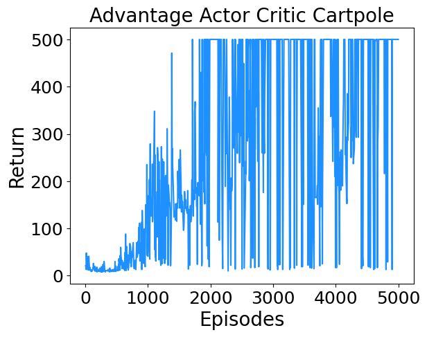
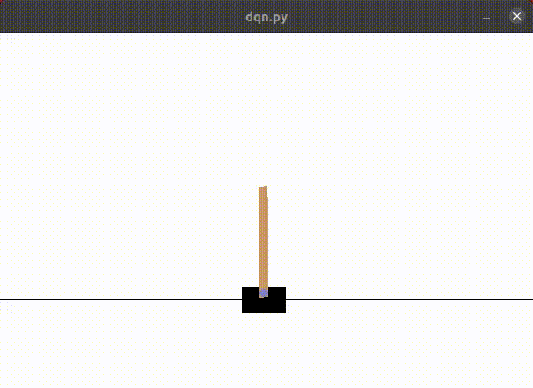

# A3C (Under development)
A clean and minimal implementation of A3C (Asynchronous Advantage Actor Critic) algorithm in Pytorch.

## Versions
* Single threaded version : ac.py
* Multithreaded synchronous version i. e. A2C : a2c.py
* Multithreaded asynchronous version i. e. A3C : a3c.py

## References
* "Asynchronous Methods for Deep Reinforcement Learning", Mnih et al. [Link](https://arxiv.org/abs/1602.01783).

## Tested on
* [Cart Pole](https://gym.openai.com/envs/CartPole-v1/) (OpenAI Gym) - Move back and forth to balance a pole on a cart.

