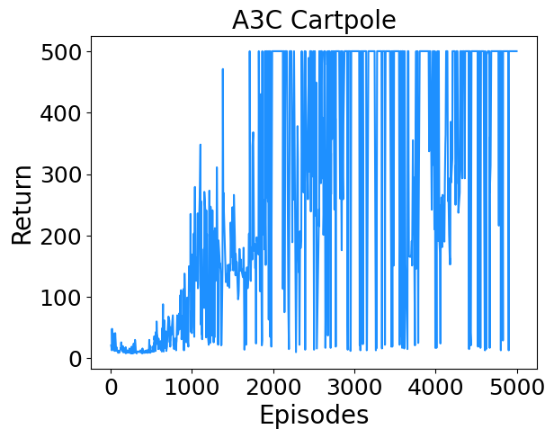

# A3C (Under development)
A clean and minimal implementation of A3C (Asynchronous Advantage Actor Critic) algorithm in Pytorch.

## Versions

Discrete action space
* Single threaded version : ac_discrete.py
* Multithreaded synchronous version i. e. A2C : a2c_discrete.py
* Multithreaded asynchronous version i. e. A3C : a3c_discrete.py

Continuous action space
* Single threaded version : ac_continuous.py

## Tested on
* [Cart Pole](https://www.gymlibrary.dev/environments/classic_control/cart_pole/) (Discrete version from OpenAI Gym) - Move back and forth to balance a pole on a cart.

## References
* "Asynchronous Methods for Deep Reinforcement Learning", Mnih et al. [Link](https://arxiv.org/abs/1602.01783).
